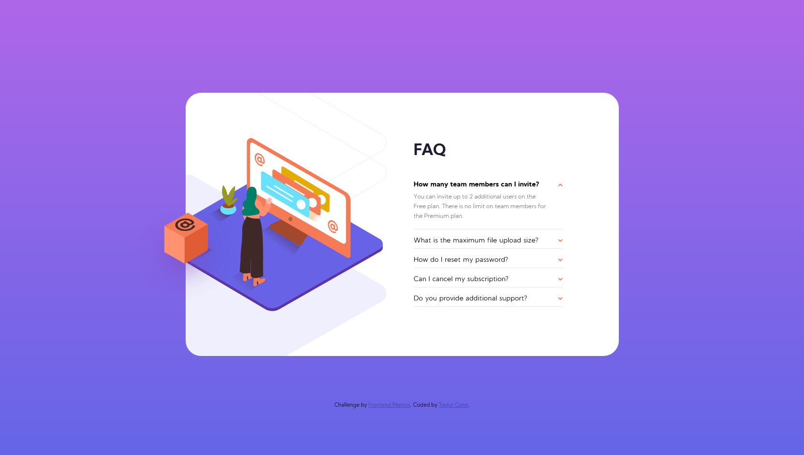
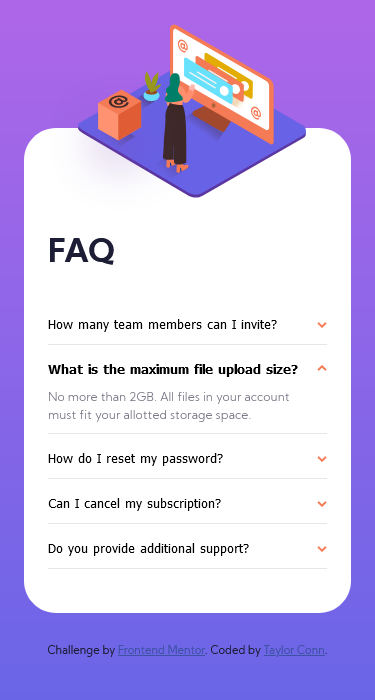

# Frontend Mentor - FAQ accordion card solution

This is a solution to the [FAQ accordion card challenge on Frontend Mentor](https://www.frontendmentor.io/challenges/faq-accordion-card-XlyjD0Oam). Frontend Mentor challenges help you improve your coding skills by building realistic projects. 

## Table of contents

- [Overview](#overview)
  - [The challenge](#the-challenge)
  - [Screenshot](#screenshot)
  - [Links](#links)
- [My process](#my-process)
  - [Built with](#built-with)
  - [What I learned](#what-i-learned)
  - [Continued development](#continued-development)
  - [Useful resources](#useful-resources)
- [Author](#author)


## Overview

### The challenge

Users should be able to:

- View the optimal layout for the component depending on their device's screen size
- See hover states for all interactive elements on the page
- Hide/Show the answer to a question when the question is clicked

### Screenshots

 



### Links

- Live Site URL: [View live on Vercel](https://accordian-faq-eta.vercel.app/)

## My process

### Built with

- Semantic HTML5 markup
- CSS/Sass custom properties
- Flexbox
- Mobile-first workflow
- Vanilla Javascript


### What I learned

Using button elements as JS targets that change sibling elements inside them after clicking was a new task for me. Another "aha!" moment was figuing out how to also have the arrow indicator flip after a FAQ item dropped down.

Aligning the illustrations proved to be a bit of a puzzle, but making the shadow line image a background image then positioning the desktop and mobile version of the image of the woman over it with a class using translates and positioning, then layering the box over them with a z-index was a great work-around.

Here are some code snippets that I'm proud of:

```html
<div class="accordion_item">
  <button class="accordion_question">How many team members can I invite?<span class="arrow"></span>
  </button>
    <p class="accordion_content">
      You can invite up to 2 additional users on the Free plan. There is no limit on team members for the Premium plan.
    </p>
</div>
```
```css
.open .accordion_question{
    font-weight: 600;
}
 
.open .accordion_content{
    display: block;
}

.open .arrow{
    transform: rotate(180deg);
}
```
```js
question.forEach(question => {
        question.addEventListener('click', (e) => {
            const faqItem = e.currentTarget.closest('.accordion_item');
            item.forEach(item => {
                if (item != faqItem) {
                    item.classList.remove('open')
                }
            })
            faqItem.classList.toggle('open')
        })
    })
```

### Continued development

My most important goal right now is expanding my knowledge of Javascript.

### Useful resources

- [Example resource 1](https://getbootstrap.com/docs/5.0/components/accordion/) - I started building my accordion based off of this boostrap version.


## Author

- Website - [Taylor Conn](https://tayconn.github.io)
- Frontend Mentor - [@gdsslight](https://www.frontendmentor.io/profile/gdsslight)

